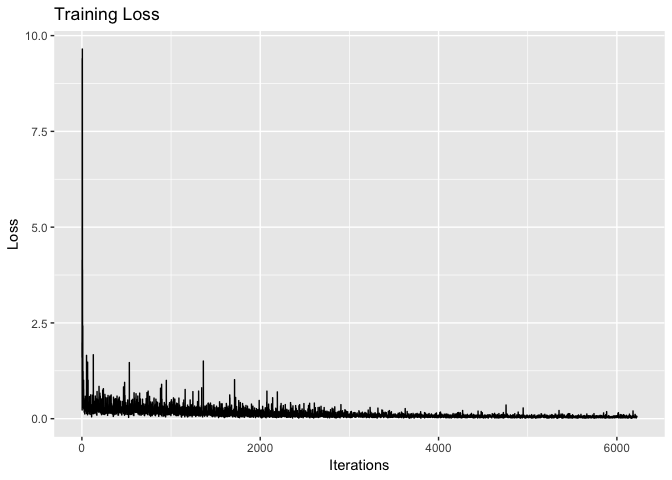

231N Final Project Notes
================
Samantha Robertson & Rohun Saxena
2018-05-30

-   [Cascaded Model: Notes](#cascaded-model-notes)
-   [Metadata](#metadata)

``` r
# Libraries
library(tidyverse)

# METADATA =====================================================================
file_metadata = "~/ATLAS_R1.1/ATLAS_Meta-Data_Release_1.1_standard_mni.csv"
# ==============================================================================

# BASELINE =====================================================================
file_atlas <- "~/Desktop/log.txt" # Baseline ATLAS model - Dice 0.26?
file_unet <- "~/Desktop/log-1.txt" # Baseline UNet - Dice 0.06
# ==============================================================================

# CASCADED MODEL ===============================================================
file_cascade_1 <- "~/Desktop/231N/cascadelog.txt" # First attempt. Loss is going
# down but very quickly at the start and is then stuck. Dice 0
# ==============================================================================
```

Cascaded Model: Notes
---------------------

-   First attempt: one ATLAS Model immediately feeds into another ATLAS model. First has loss wce with weight=100, second has wce with weight=1/100. Loss looks ass. Dice coefficient 0

-   1.  Figure out if Dice Coeff broken.

-   1.  Train two separate models to (1) see if they work alone and (2) see if a different cascade works

``` r
file <- file_cascade_1

data <- 
  file %>% 
  read_csv(
    skip = 3,
    col_names = FALSE
  )
```

    ## Parsed with column specification:
    ## cols(
    ##   X1 = col_character(),
    ##   X2 = col_character(),
    ##   X3 = col_character(),
    ##   X4 = col_character(),
    ##   X5 = col_character(),
    ##   X6 = col_character()
    ## )

    ## Warning in rbind(names(probs), probs_f): number of columns of result is not
    ## a multiple of vector length (arg 1)

    ## Warning: 828 parsing failures.
    ## row # A tibble: 5 x 5 col     row col   expected  actual    file                            expected   <int> <chr> <chr>     <chr>     <chr>                           actual 1   100 <NA>  6 columns 1 columns '~/Desktop/231N/cascadelog.txt' file 2   101 <NA>  6 columns 1 columns '~/Desktop/231N/cascadelog.txt' row 3   202 <NA>  6 columns 1 columns '~/Desktop/231N/cascadelog.txt' col 4   203 <NA>  6 columns 1 columns '~/Desktop/231N/cascadelog.txt' expected 5   204 <NA>  6 columns 3 columns '~/Desktop/231N/cascadelog.txt'
    ## ... ................. ... ................................................................. ........ ................................................................. ...... ................................................................. .... ................................................................. ... ................................................................. ... ................................................................. ........ .................................................................
    ## See problems(...) for more details.

``` r
train_loss_data <- 
  data %>% 
  filter(
    str_detect(X1, "INFO:root:epoch"),
    str_detect(X3, "^loss "),
    !(is.na(X3))
  ) %>% 
  transmute(
    iter = as.integer(str_extract(X2, "\\d+")),
    loss = as.double(str_extract(X3, "\\d.\\d+"))
  )

dev_loss_data <- 
  data %>% 
  filter(
    str_detect(X3, "dev_loss")
  ) %>% 
  transmute(
    iter = as.integer(str_extract(X2, "\\d+")),
    loss = as.double(str_extract(X3, "\\d.\\d+"))
  )

dice_data <- 
  data %>% 
  filter(
    str_detect(X3, "dice_coefficient")
  ) %>%
  transmute(
    data = str_extract(X3, "^[^ ]+"),
    iter = as.integer(str_extract(X2, "\\d+")),
    dice = as.double(str_extract(X3, "\\d.\\d+"))
  )
```

``` r
train_loss_data %>% 
  ggplot(aes(iter, loss)) +
  geom_line() +
  labs(
    x = "Iterations",
    y = "Loss",
    title = "Training Loss"
  )
```



``` r
dev_loss_data %>% 
  ggplot(aes(iter, loss)) +
  geom_line() +
  geom_point() +
  labs(
    x = "Iteration",
    y = "Loss",
    title = "Dev Loss"
  )
```


``` r
dice_data %>% 
  ggplot(aes(iter, dice, color = data)) +
  geom_line(aes(group = data)) +
  geom_point() +
  labs(
    x = "Iteration",
    y = "Dice Coefficient",
    title = "Evaluation",
    color = "Dataset"
  )
```


Metadata
--------

``` r
metadata <-
  file_metadata %>% 
  read_csv() %>% 
  rename_all(funs(str_to_lower(str_replace_all(., "[ ]+", "_"))))
```

    ## Parsed with column specification:
    ## cols(
    ##   `INDI Site ID` = col_character(),
    ##   `INDI Subject ID` = col_integer(),
    ##   Session = col_character(),
    ##   `# Strokes LH Cortical` = col_integer(),
    ##   `# Strokes LH subcortical` = col_integer(),
    ##   `# Strokes RH Cortical` = col_integer(),
    ##   `# Strokes RH subcortical` = col_integer(),
    ##   `Other Location` = col_integer(),
    ##   `Stroke type` = col_character(),
    ##   `Primary Stroke Location` = col_character(),
    ##   `Primary Stroke Location Hemisphere` = col_character(),
    ##   `Vascular territory` = col_character(),
    ##   PVH = col_integer(),
    ##   DWMH = col_integer(),
    ##   Notes = col_character()
    ## )

``` r
summary(metadata)
```

    ##  indi_site_id       indi_subject_id   session         
    ##  Length:229         Min.   :31768   Length:229        
    ##  Class :character   1st Qu.:31825   Class :character  
    ##  Mode  :character   Median :31882   Mode  :character  
    ##                     Mean   :31881                     
    ##                     3rd Qu.:31939                     
    ##                     Max.   :31987                     
    ##  #_strokes_lh_cortical #_strokes_lh_subcortical #_strokes_rh_cortical
    ##  Min.   :0.000         Min.   :0.00             Min.   :0.0000       
    ##  1st Qu.:0.000         1st Qu.:0.00             1st Qu.:0.0000       
    ##  Median :0.000         Median :1.00             Median :0.0000       
    ##  Mean   :0.179         Mean   :0.69             Mean   :0.1354       
    ##  3rd Qu.:0.000         3rd Qu.:1.00             3rd Qu.:0.0000       
    ##  Max.   :2.000         Max.   :5.00             Max.   :2.0000       
    ##  #_strokes_rh_subcortical other_location   stroke_type       
    ##  Min.   :0.0000           Min.   :0.0000   Length:229        
    ##  1st Qu.:0.0000           1st Qu.:0.0000   Class :character  
    ##  Median :1.0000           Median :0.0000   Mode  :character  
    ##  Mean   :0.6288           Mean   :0.1397                     
    ##  3rd Qu.:1.0000           3rd Qu.:0.0000                     
    ##  Max.   :5.0000           Max.   :2.0000                     
    ##  primary_stroke_location primary_stroke_location_hemisphere
    ##  Length:229              Length:229                        
    ##  Class :character        Class :character                  
    ##  Mode  :character        Mode  :character                  
    ##                                                            
    ##                                                            
    ##                                                            
    ##  vascular_territory      pvh            dwmh          notes          
    ##  Length:229         Min.   :0.00   Min.   :0.000   Length:229        
    ##  Class :character   1st Qu.:1.00   1st Qu.:1.000   Class :character  
    ##  Mode  :character   Median :1.00   Median :1.000   Mode  :character  
    ##                     Mean   :1.48   Mean   :1.415                     
    ##                     3rd Qu.:2.00   3rd Qu.:2.000                     
    ##                     Max.   :3.00   Max.   :3.000

``` r
metadata %>% 
  count(primary_stroke_location_hemisphere) %>% 
  mutate(
    primary_stroke_location_hemisphere = factor(
      primary_stroke_location_hemisphere, 
      levels = c("Left", "Right", "Brainstem", "Bilateral"), 
      ordered = TRUE
    )
  ) %>% 
  ggplot(aes(primary_stroke_location_hemisphere, n)) +
  geom_col() +
  labs(
    x = "Primary stroke location (hemisphere)",
    y = "Number of Brains"
  )
```


